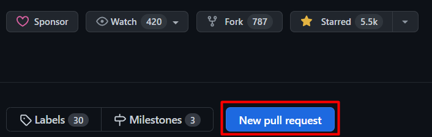
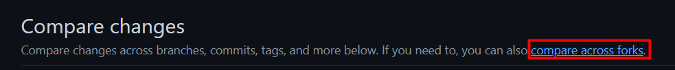
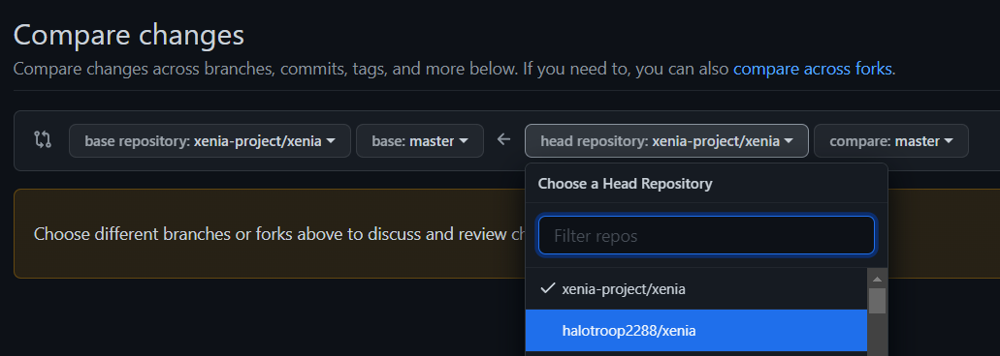
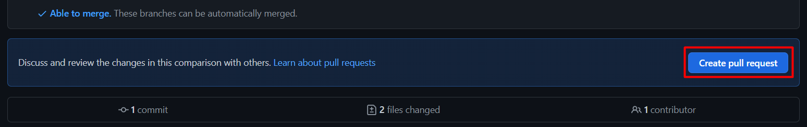
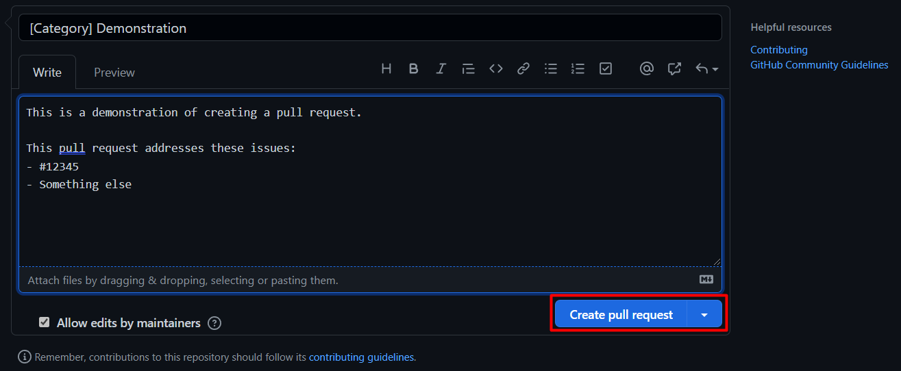

# Contribute to Xenia

So, you want to contribute to Xenia's development?
Here are the steps you'll need to take to get started:

- Have a computer capable of running Xenia, and install the required system components:
    - See [System Requirements](/faq/quickstart/system_requirements)
- Learn the language 
    - An often overlooked aspect to newcomers is having an understanding of the language the project is written in. 
    - Xenia uses [C++ 17](https://en.wikipedia.org/wiki/C%2B%2B17) for development.
      If you don't know this language, you may [learn the basics on YouTube](https://www.youtube.com/watch?v=-c83JEsu350),
      but it may take a while to get a full grasp of it. 
    - In addition, to submit your contributions, you'll need to know how to use [Git](https://www.git-scm.com/book/en/v2/Getting-Started-What-is-Git%3F).
      - Here is a [crash course](https://www.youtube.com/watch?v=SWYqp7iY_Tc) on Git to help you out.
- Learn to [build Xenia from source](building) 
  This step should give you all you need to start developing Xenia with Visual Studio on Windows or Codelite on Linux.
- Follow the [style guide](style_guide) 
  Run `xb format` before creating a pull request.

When you're ready, fork Xenia on GitHub, and push your changes. Then create a pull request on GitHub.

1. Click the `New Pull Request` button at the top right of the page:
)

2. Click `Compare Across Forks` to compare with your fork:

3. Select your own fork from the list:

4. Review your selection. Make sure you have selected the correct branch.

5. Click `Create Pull Request` to confirm your selection:

6. Write a title and description for your pull request. When you're done, press `Submit Pull Request`

