# How to Rip / Dump Games

**YOU CANNOT PLAY GAMES DIRECTLY FROM THE DISC DRIVE, OR USE AN XBOX ONE/SERIES TO RIP GAMES!**

## Stock console method

### Requirements

* Xbox 360 console
* USB storage device that's at least 16GB. You *might* encounter problems with smaller devices.
* [Velocity](https://github.com/Gualdimar/Velocity/releases/download/xex%2Biso-branch/Velocity-XEXISO.rar)

If you're wanting to rip games from disc:
  * Xbox 360 game disc
  * Xbox 360 that can read discs

### Preparation

Before beginning, you need to check if the USB is formatted:

> Go to *[Settings > System](https://i.imgur.com/xcCn6fM.png) > [Storage](https://i.imgur.com/No4y9xi.png)*

??? info "Settings > System:"
    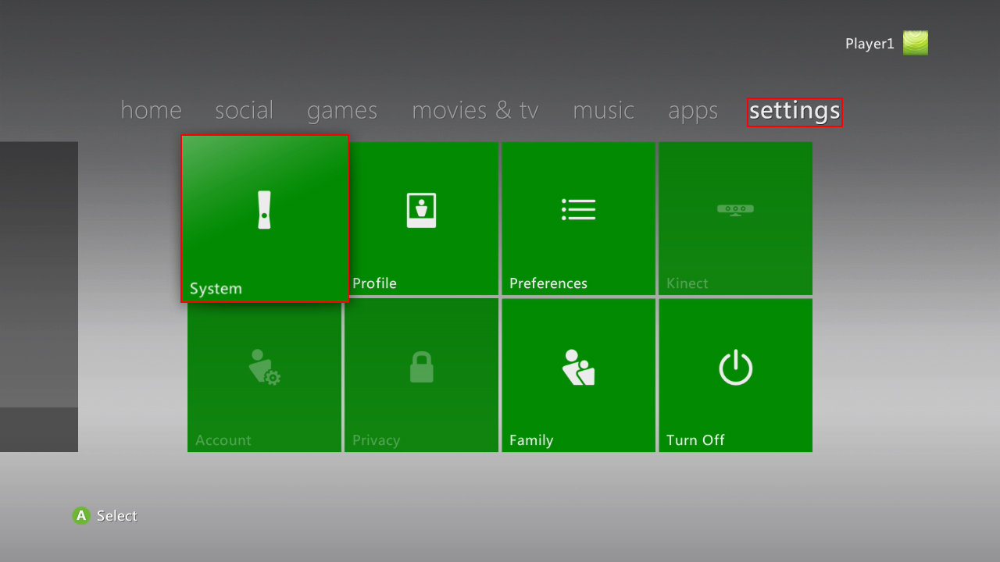

??? info "Storage:"
    

2. If you see an [Unformatted](https://i.imgur.com/Jex2sln.png) storage device, select it.
Image (click to expand)

??? info "Unformatted:"
    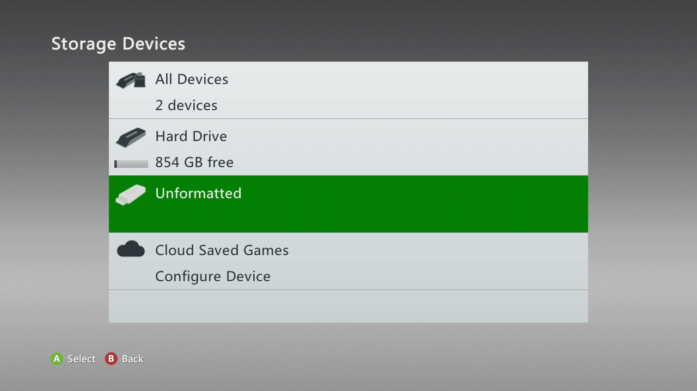

* If it's already formatted, skip this section.
3. [Press A to format](https://i.imgur.com/tIW9spr.png)
4. [Select Yes](https://i.imgur.com/rKvf04S.png)

??? info "Press A to format:"
    
??? info "Select Yes:"
    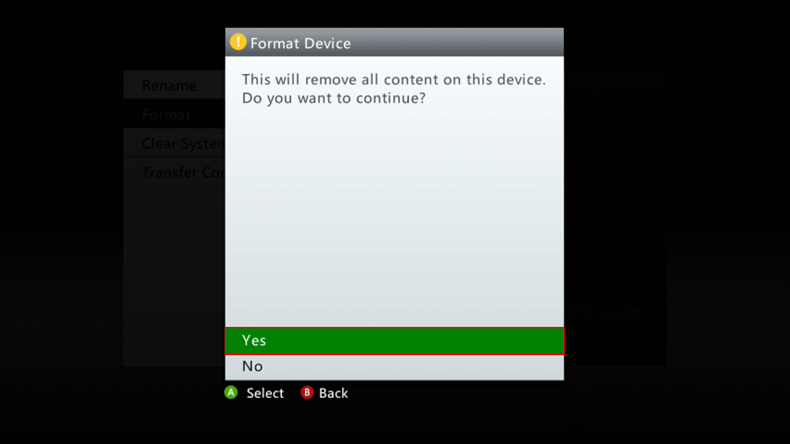
!!! warning "**This will erase everything from the drive. Make sure to move the files off of it first!**"
5. Once done, return to home by pressing B twice.

### 1. Ripping discs

*If your game isn't a disc (XBLA, digital, etc.) skip to Section 2.*

You'll want to change these options to stop game(s) from automatically starting:
> *[Settings > System](images/xcCn6fM.png) > [Console Settings](images/FStw2Y7.png) > [Auto-Play](images/r4lLczk.png) > [Disable](images/V5oEdQl.png)*

??? info "Settings > System:"
    

??? info "Console Settings:"
    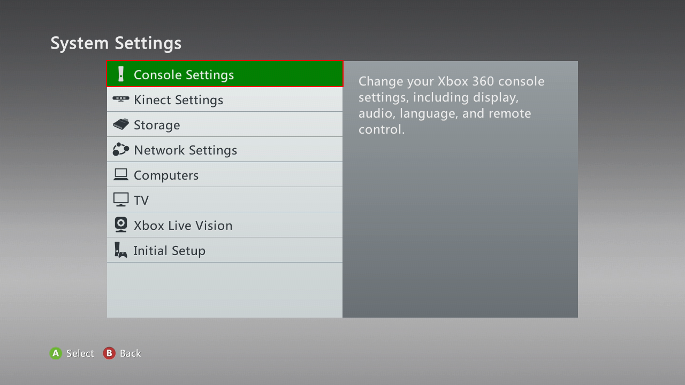

??? info "Auto-Play:"
    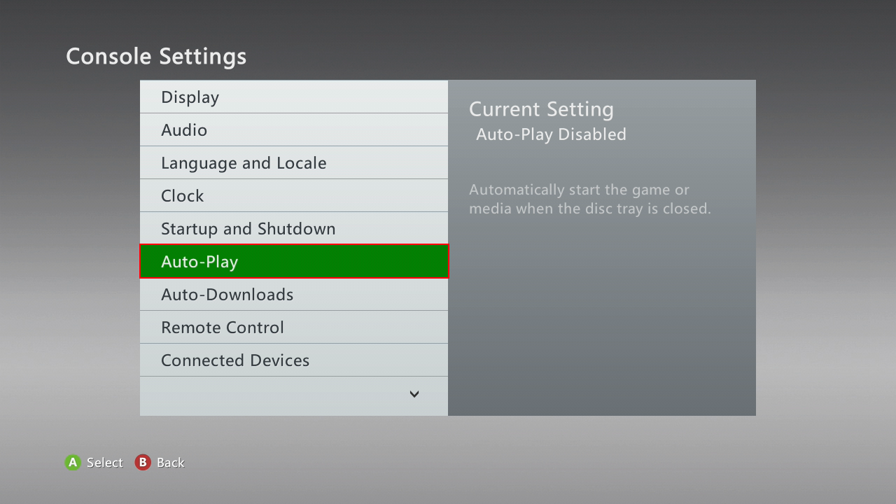

??? info "Disable:"
    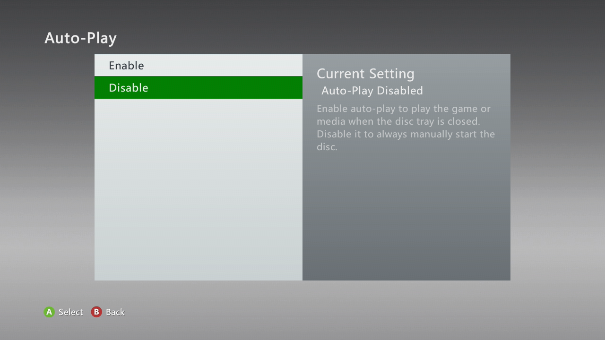

> *[Settings > System](images/xcCn6fM.png) > [Console Settings](images/FStw2Y7.png) > [Startup and Shutdown](images/DgblBFS.png) > [Startup](images/GJpqOrH.png) > [Xbox Dashboard](images/H4ffGAV.png)*

??? "Settings > System:"
    

??? "Console Settings:"
    

??? "Startup and Shutdown:"
    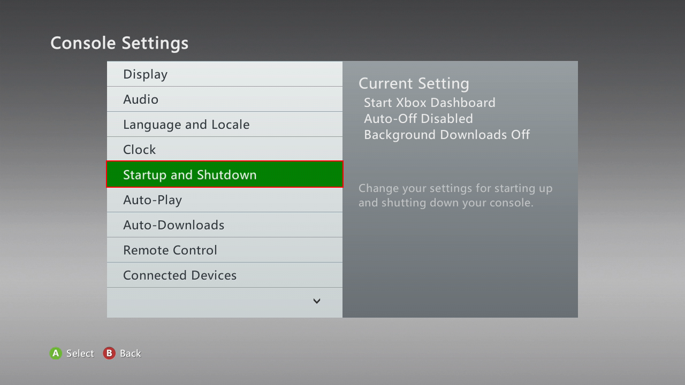

??? info "Startup:"
    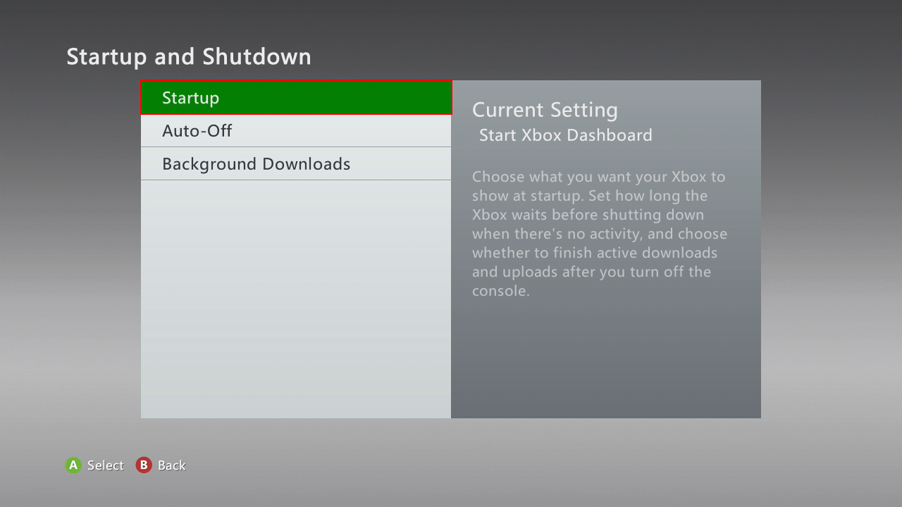

??? info "Xbox Dashboard:"
    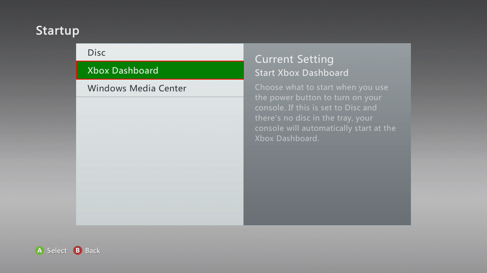

1. Go to home on the dashboard
2. Insert the disc into the drive, and close the tray.
3. Once the game shows up press X (Game Details) with the game selected.
4. Press the *Install* button.
    * If you see *Delete* instead, skip to Section 2.
      * Note: Not all games have the *Install* option. List of currently known uninstallable games:
        * College Hoops 2k7
        * Minecraft
        * Pocket Bike Racers
        * Sneak King
        * Crackdown **(Can be installed with latest title update)**
        * Dead or Alive Xtreme 2
5. Select the storage device you want to install the game on.
6. Once it's 100% Completed press A to continue, and press B to go back to home.

### 2. Transferring HDD games

***If you ripped the game(s) directly to the USB drive, or they're already on the USB drive, you can skip this section.***
1. Go to *[Settings > System](images/xcCn6fM.png) > [Storage](https://i.imgur.com/No4y9xi.png) > [Hard Drive](https://i.imgur.com/8EB0EFr.png) > [Press Y (Device Options)](https://i.imgur.com/rRaoeAR.png) > [Transfer Content](https://i.imgur.com/wdvYqDR.png) > [USB Storage Device](https://i.imgur.com/6FVly57.png)*
4. Choose what you want to transfer. Keep in mind full games and trials/demos are in separate categories.

??? info "Settings > System:"
    

??? info "Storage:"
    

??? info "Hard Drive:"
    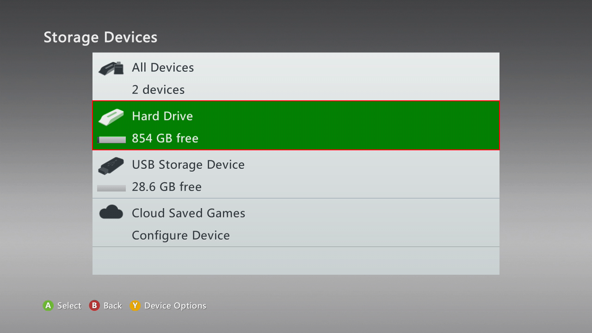

??? info "Press Y (Device Options):"
    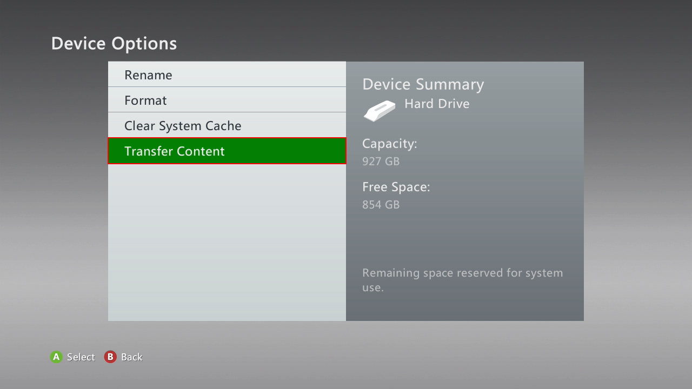

??? info "Transfer Content:"
    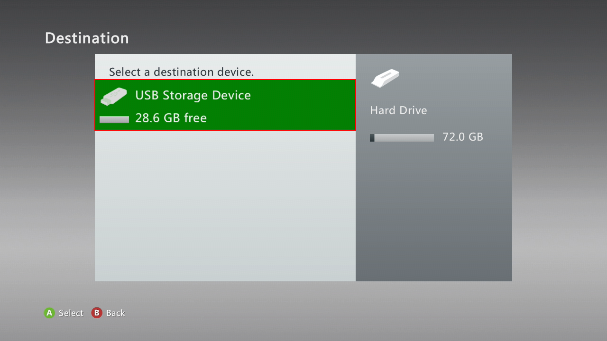

??? info "USB Storage Device:"
    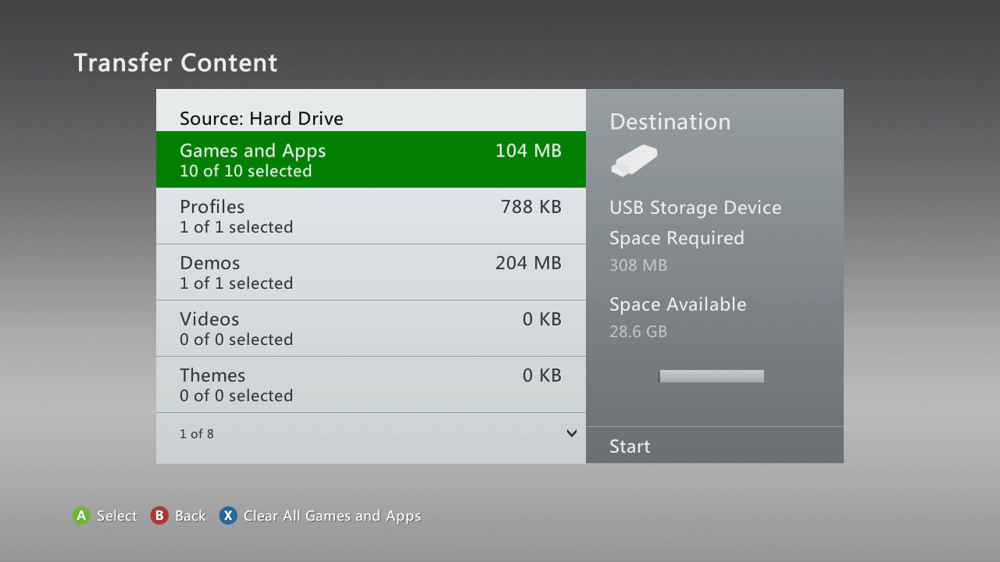

> Press right, then *[Start](images/Gpb5Zya.png)*.

??? info "Start:"
    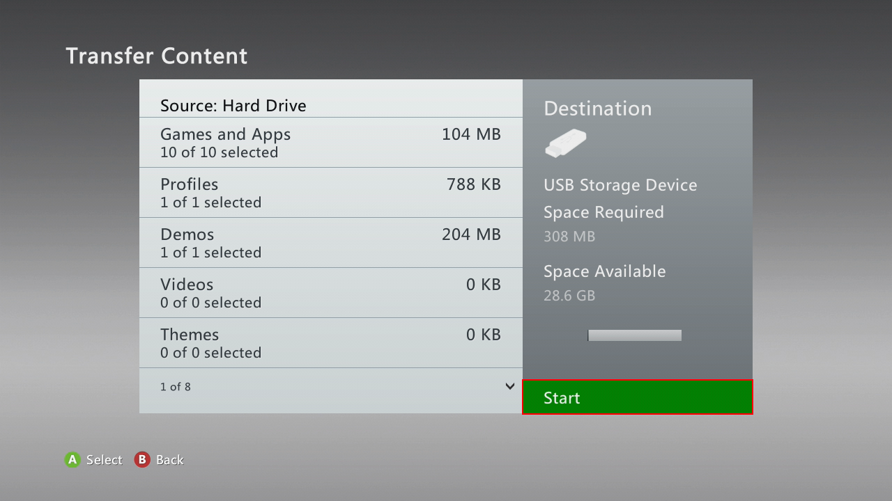

Once it's done you can take the USB out of the console.

<!---

## Redump method (rare/specific drives)

*For these DVD drives:*
  * SH-D163A / TS-H353A
  * SH-D163B / TS-H353B
  * SH-162C / TS-H352C / SD-M2012C(?)
  * SH-D162D / TS-H352D

--->

### 3. Importing games for use in Xenia

1. Insert the USB drive into your PC. Go to `Content`.
    * If the USB drive appears empty enable *[Show hidden files and folders](https://support.microsoft.com/en-us/help/14201/windows-show-hidden-files)* in Windows Explorer.
2. Go into `00000#`. There will be folders with names consisting of lots of letters and numbers. You should find the game's folder within one of them.
3. The game will have a name with a bunch of letters and numbers just like the folders, and no file extension.
    * XBLA games will be one file, GOD (disc) games will contain a file, along with a *.data folder with the same name.
    * *ContentCache.pkg is irrelevant. Ignore it.*
 4. To confirm that it is indeed a game try opening the file in Xenia.
 5. Once you've made sure the file works in Xenia you can rename, or move the folder the game is in for convenience.
    * **FOLDER ABOVE, NOT FILE or *.DATA FOLDER!**
      * (Optional) If the game crashes you can try extracting the game using Velocity.
      * If the game is extracted you will need to drag `default.xex` onto Xenia.
      * Some games have multiple .xex files, so if you can't find `default.xex` or it just doesn't work, try another one.

!!! info "See also"
    [Redump Xbox and Xbox 360 dumping guide](http://wiki.redump.org/index.php?title=Microsoft_Xbox_and_Xbox_360_Dumping_Guide)

!!! success "Next section..."
    - [Installing DLCs](install_dlc)
    - [Activating Licenses (DLCs and Trials)](activate_games)
