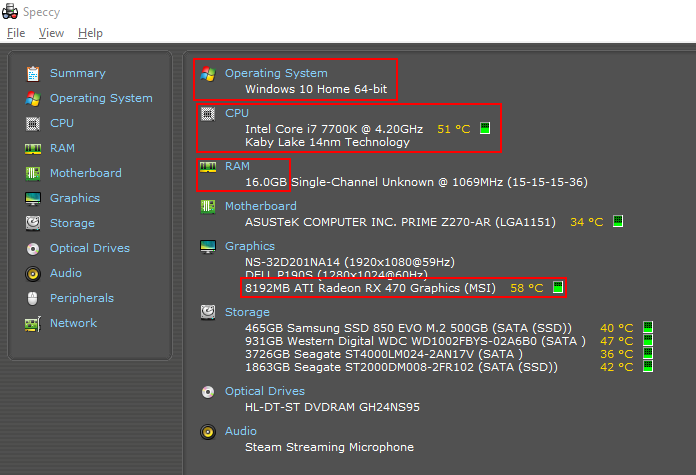
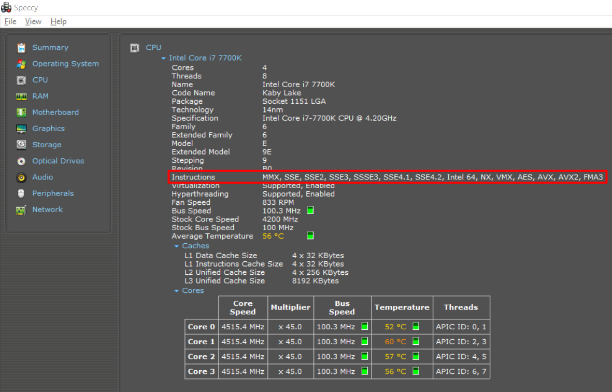

# System Requirements

**Meeting recommended specifications won't guarantee perfect performance.**

??? info "How to find relevant specs in [Speccy](https://www.ccleaner.com/speccy) on Windows"
    On the first page, you'll find your operating system, CPU, GPU, and amount of RAM.
    
    On the CPU page, you'll find your CPU instruction extensions. (Look for `AVX2`)
    

<!--- TODO(halotroop2288)
??? info "How to find relevant specs on Linux"
    1.    Enter [this command](https://www.howtoforge.com/linux-lscpu-command/) on the command line to see information about your CPU:
        ```sh
        lscpu
        ```
        You're looking for the Model name, and `avx2` under Flags.
    2.    Enter [this command](https://www.tutorialspoint.com/unix_commands/lspci.htm) to see information about your gpu.
        ```sh
        lspci
        ```
        The first line should say the name of your graphics device.
--->

## Recommended:

* OS: Windows 10+ x64
* CPU: 4th generation or later i5/i7 64-bit x86 processor with AVX(2) support
* GPU: GTX 980 Ti or later
* RAM: 6GB or more
* [Microsoft Visual C++ Redistributable](https://aka.ms/vs/16/release/vc_redist.x64.exe)

### Minimum:

* OS: Windows 7+ x64 (Linux/macOS not *natively* supported)
  * **Windows <10 support is limited. *Don't expect anything to work.***
  * Runs on Linux with Wine *using Vulkan*.
* CPU: 64-bit x86 processor with AVX(2) support
* GPU: Direct3D 12-compatible or Vulkan-compatible GPU from [this list](https://vulkan.gpuinfo.org/)
  * Direct3D 12 will only work on Windows 10 due to D3D12on7 and vkd3d not being supported.
  * GPUs without [ROV (rasterizer-ordered view) / fragment shader interlock](FAQ#what-is-rov) support will perform worse and possibly have more graphical issues. Integrated GPUs will also generally provide frame rates too low for comfortable playing.
    * AMD GPUs also fall under this due to Xenia triggering driver bugs causing crashes.
* RAM: 4GB
* [The Latest x64 Visual C++ Redistributable](https://support.microsoft.com/en-us/help/2977003/the-latest-supported-visual-c-downloads)

Xenia doesn't require any Xbox 360 system files.

Xenia will check for the minimum supported CPU and GPU on startup and error out
if one is not detected. Make sure that you have the latest drivers installed. **You cannot just remove the checks in the code and assume things will work.**

***There are no magical workarounds to make Xenia work on your potato computer.***

***OpenGL and Direct3D11 or lower are not, and never will be supported.***

Windows Update tends to lag behind, so download GPU drivers from your manufacturer:
    - **[AMD](https://www.amd.com/en/support)**
    - **[NVIDIA](https://www.nvidia.com/Download/index.aspx)**
    - **[Intel](https://downloadcenter.intel.com/product/80939/Graphics-Drivers)**

!!! success "Next section..."
    - [Where to Download Xenia](download)
